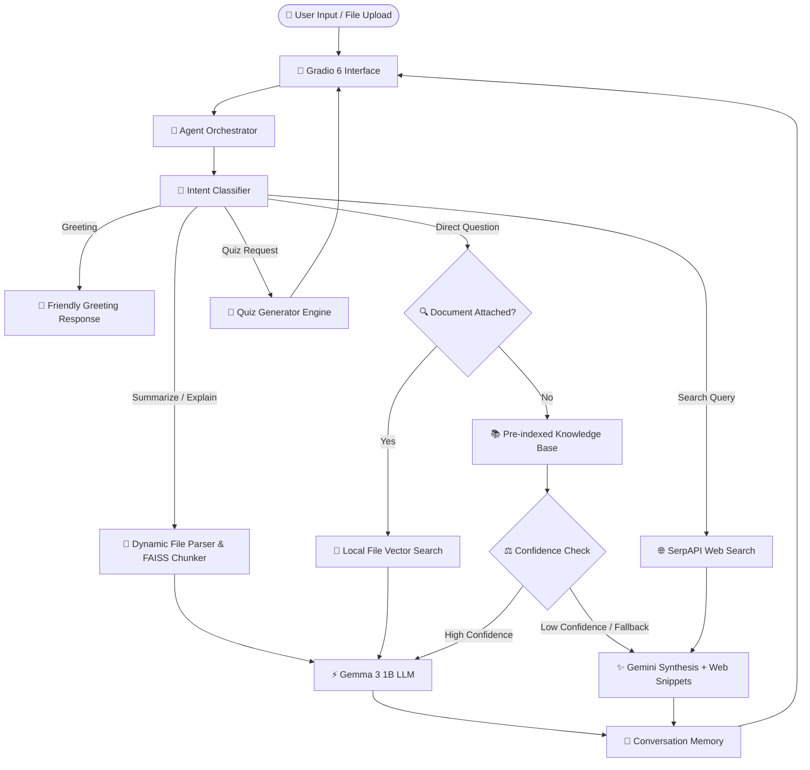

# ⚡ TutAI — Intelligent Educational Assistant & RAG Chatbot

<div align="center">

[](https://huggingface.co/spaces/AdhamHesham/TutAI)
[](https://gradio.app/)
[](https://pytorch.org/)
[](https://www.langchain.com/)
[](https://github.com/facebookresearch/faiss)
[](https://huggingface.co/AdhamHesham/gemma3_1B_tutai)

**TutAI** is an advanced, agentic educational chatbot and retrieval-augmented generation (RAG) assistant designed to enhance learning, document comprehension, study assessments, and factual research.

[Explore on Hugging Face Spaces](https://huggingface.co/spaces/AdhamHesham/TutAI) • [Report Bug / Request Feature](https://github.com/AdhamHesham07/TutAI/issues)

</div>

---

## 🌟 Key Features

- 🧠 **Fine-Tuned Local LLM Generation**: Powered by [`AdhamHesham/gemma3_1B_tutai`](https://huggingface.co/AdhamHesham/gemma3_1B_tutai), optimized for fast, accurate on-device reasoning and pedagogical responses.
- 📚 **Vector-Powered Document Intelligence**: Upload `.pdf`, `.docx`, or `.txt` course materials to dynamically chunk, embed, and query your study notes using localized FAISS indices.
- 🎯 **Smart Intent Classification**: Automatically categorizes user requests into Greetings, Direct Questions, Document Summaries, Deep Explanations, Interactive Quizzes, or Web Searches.
- 📝 **Automated Study Quiz Generation**: Automatically generates custom multiple-choice assessment quizzes from your notes or web-retrieved passages to test understanding.
- 🌐 **Hybrid Web Retrieval & Synthesis**: Integrates SerpAPI real-time web search and Gemini synthesis when high-confidence knowledge or recent information is required.
- 💾 **Contextual Session Memory**: Maintains multi-turn conversational context for seamless student-tutor dialogue.
- 🎨 **Modern Interactive UI**: Intuitive, responsive web interface built with Gradio 6.

---

## 🏗️ System Architecture



---

## 🛠️ Tech Stack & Dependencies

| Component | Technology | Description |
| :--- | :--- | :--- |
| **User Interface** | [Gradio 6.0.1](https://gradio.app/) | Interactive, accessible web interface |
| **Base / Local LLM** | [Gemma 3 1B TutAI](https://huggingface.co/AdhamHesham/gemma3_1B_tutai) | Fine-tuned causal language model |
| **Synthesis LLM** | [Google Gemini 2.5 Flash](https://ai.google.dev/) | High-speed multi-source synthesis |
| **Vector Database** | [FAISS](https://github.com/facebookresearch/faiss) | High-performance similarity search |
| **Embeddings** | [Sentence-Transformers](https://www.sbert.net/) | `all-MiniLM-L6-v2` dense embeddings |
| **Document Parsing** | PyMuPDF / python-docx | PDF, Word, and text extraction |
| **Web Search** | SerpAPI | Real-time web retrieval |
| **Frameworks** | PyTorch, Transformers, LangChain | Core model execution and agent pipelines |

---

## 🚀 Getting Started

### 1. Prerequisites

- Python `3.10` or higher
- [Git](https://git-scm.com/) and [Git LFS](https://git-lfs.com/)
- CUDA-compatible GPU (recommended for local model acceleration, CPU fallback supported)

### 2. Clone the Repository

```bash
# Ensure Git LFS is initialized
git lfs install

# Clone the repository
git clone https://github.com/AdhamHesham07/TutAI.git
cd TutAI
```

### 3. Create a Virtual Environment

```bash
# On Linux / macOS
python3 -m venv venv
source venv/bin/activate

# On Windows (PowerShell)
python -m venv venv
.\venv\Scripts\Activate.ps1
```

### 4. Install Dependencies

```bash
pip install --upgrade pip
pip install -r requirements.txt
```

### 5. Configure Environment Variables

Create a `.env` file in the project root by copying `.env.example`:

```bash
cp .env.example .env
```

Edit `.env` and fill in your API keys:

```env
# Optional / Hybrid Synthesis Keys
GEMINI_API_KEY="your_gemini_api_key_here"
SERPAPI_API_KEY="your_serpapi_key_here"
HUGGINGFACE_API="your_huggingface_token_here"
WOLFRAM_APP_ID="your_wolfram_app_id_here"
```

> **Note**: If `GEMINI_API_KEY` or `SERPAPI_API_KEY` are not set, local RAG responses and document querying continue to operate with the local model.

---

## 💻 Running the Application

Launch the Gradio application locally:

```bash
python app.py
```

Once started, open your browser and navigate to:
```
http://localhost:7860
```

---

## 📂 Project Structure

```
TutAI/
├── agent/                  # Agent logic and orchestration
│   ├── confidence.py       # Confidence calculation & thresholds
│   ├── intents.py          # Intent classification logic
│   ├── orchestrator.py     # Central multi-turn agent handler
│   └── router.py           # Routing and synthesis pipelines
├── config/                 # Configuration & settings
│   └── settings.py         # Model paths, thresholds, and hyperparameters
├── data/                   # Knowledge base vector index & chunks (Git LFS)
│   ├── chunks.pkl          # Pre-processed knowledge chunks
│   └── faiss_index.bin     # FAISS dense vector index
├── llm/                    # Local model execution & prompt engineering
│   ├── model_loader.py     # Local model generation helper
│   └── prompt_templates.py # Specialized educational prompt templates
├── rag/                    # Retrieval-Augmented Generation core
│   └── rag_system.py       # FAISS indexing, token chunking, and retrieval
├── tools/                  # Extensible agent tools
│   ├── memory_tool.py      # Conversation history management
│   ├── parser_tool.py      # Multi-format document parser (.pdf, .docx, .txt)
│   ├── quiz_tool.py        # Automated MCQ quiz generator
│   └── search_tool.py      # SerpAPI web retrieval tool
├── .env.example            # Environment variables template
├── .gitattributes          # Git LFS tracking rules
├── .gitignore              # Git ignore rules for privacy & cleanliness
├── app.py                  # Main Gradio web application entry point
├── README.md               # Project documentation
└── requirements.txt        # Python package dependencies
```

---

## 📖 Usage Examples

### 📄 Document Analysis & Summaries
Upload lecture notes or textbook chapters (`.pdf`, `.docx`, `.txt`) and prompt:
> *"Summarize this document focusing on the key formulas and core principles."*

### ❓ Document-Specific Q&A
Ask direct questions regarding your uploaded document:
> *"Based on page 4 of the uploaded file, what is the definition of gradient descent?"*

### 📝 Generate Practice Quizzes
Test your knowledge by requesting custom quizzes:
> *"Create a 5-question multiple choice quiz based on the uploaded lecture."*

### 🌐 Real-Time Academic Research
Ask broader academic or factual queries:
> *"Search for recent breakthroughs in quantum computing error correction."*

---

## 🤝 Contributing

Contributions, bug reports, and feature requests are welcome!

1. Fork the repository
2. Create your feature branch (`git checkout -b feature/AmazingFeature`)
3. Commit your changes (`git commit -m 'feat: add amazing educational feature'`)
4. Push to the branch (`git push origin feature/AmazingFeature`)
5. Open a Pull Request

---

## 📄 License

This project is open-source under the [MIT License](LICENSE).

---

<div align="center">
Developed with ❤️ by <a href="https://github.com/AdhamHesham07">Adham Hesham</a>
</div>
